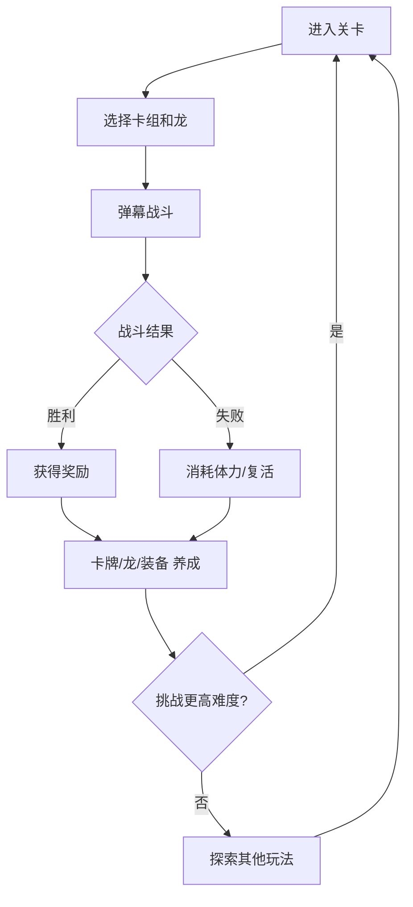

# 《龙翼弹幕》策划案

> 生成时间：2026-01-08
> 版本：Ver 0.1
> 类型：飞行弹幕 × 数值卡牌 × RPG

---

## 一、游戏概述

### 核心愿景

**"驾驭神龙，编织弹幕，构筑属于你的空战卡组"**

玩家扮演龙骑士，与契约神龙一同翱翔天际，通过卡牌构筑弹幕技能组合，在华丽的空战中击败敌人。

### 游戏类型

竖版飞行弹幕射击 + 卡牌构筑 + RPG养成

### 目标平台

- 主平台：移动端（iOS / Android）
- 次要平台：PC（Steam）

### 目标受众

- 核心用户：喜欢弹幕射击游戏、卡牌构筑的中重度玩家
- 次要用户：喜欢龙主题、收集养成的泛游戏用户
- 年龄段：18-35岁

---

## 二、玩法支柱

### 支柱 1: 弹幕战斗
- **核心体验**：爽快的弹幕射击手感，华丽的技能特效
- **关键机制**：实时操控龙骑士躲避敌方弹幕，释放己方技能
- **与其他支柱的关系**：卡牌决定弹幕类型，龙伙伴提供被动增益

### 支柱 2: 卡牌构筑
- **核心体验**：策略性的卡组搭配，每局战斗都有不同打法
- **关键机制**：战前选择卡组，战中按顺序/触发条件释放技能卡
- **与其他支柱的关系**：卡牌品质受RPG养成影响，龙属性影响卡牌效果

### 支柱 3: 龙伙伴养成
- **核心体验**：收集、培养、进化各种神龙
- **关键机制**：龙提供属性加成、被动技能、终极技能
- **与其他支柱的关系**：龙的属性克制影响战斗，龙的技能可编入卡组

### 支柱 4: RPG成长
- **核心体验**：持续的数值成长和能力解锁
- **关键机制**：角色升级、装备强化、卡牌升阶
- **与其他支柱的关系**：成长提升战斗能力上限，解锁更多卡牌和龙

---

## 三、核心战斗系统

### 系统规则

#### 战斗模式

竖版飞行视角，玩家控制龙骑士在屏幕下半区移动

触摸/拖动控制移动，自动发射基础弹幕

技能卡按照卡组顺序，达到能量条件后自动/手动释放

#### 弹幕类型

| 类型 | 特点 | 代表卡牌 |
|------|------|----------|
| 直射型 | 高伤害，单体 | 龙息射线、穿刺箭 |
| 扩散型 | 中伤害，范围 | 烈焰吐息、冰晶散射 |
| 追踪型 | 低伤害，锁定 | 雷电链、灵魂追踪 |
| 护盾型 | 防御，消弹 | 龙鳞护盾、时间减速 |
| 召唤型 | 持续，AOE | 召唤幼龙、陨石雨 |

#### 能量系统

战斗中持续积累能量，不同技能卡消耗不同能量

能量上限为100，每秒自动回复5点

击杀敌人额外获得能量，BOSS战能量回复速度降低

#### 属性克制

龙分为5种属性，循环克制：

```
火 → 风 → 雷 → 水 → 火（循环克制，伤害+30%）
光 ↔ 暗（互相克制，伤害+50%）
```

玩家龙属性与敌人属性产生克制关系时，伤害和受伤均受影响

### 界面操作

#### 战斗界面总览

上半屏：战斗区域，显示敌人、弹幕、特效

下半屏：操控区域，显示能量条、技能卡槽、龙技能按钮

右上角：暂停按钮、战斗信息

左上角：BOSS血条（BOSS战时显示）

#### 技能卡槽

底部显示当前卡组的前5张卡牌

已就绪的卡牌亮起，可点击手动释放

自动模式下，卡牌按顺序自动释放

卡牌释放后，后续卡牌前移，新卡牌从右侧补入

#### 龙终极技能

右下角显示龙终极技能按钮

终极技能需要积累"龙魂值"，通过战斗积累

满100%后可释放，释放后清空，重新积累

释放时全屏特效，造成大范围高伤害

---

## 四、卡牌系统

### 系统规则

#### 卡牌获取

通过关卡掉落、商店购买、活动奖励获取

初次获得卡牌为基础版本，可通过升级提升

#### 卡牌品阶

卡牌分为若干个颜色品阶：

- 白色：普通
- 绿色：优秀
- 蓝色：精良
- 紫色：史诗 1阶 ~ 5阶
- 橙色：传说 1阶 ~ 5阶
- 红色：神话 1阶 ~ 5阶

#### 卡牌升级

消耗相同卡牌或通用升级材料提升卡牌等级

等级提升增加卡牌基础数值（伤害、持续时间等）

等级上限由品阶决定

#### 卡牌升阶

消耗特定材料提升卡牌品阶

升阶后数值大幅提升，可能解锁额外效果

升阶有成功率，失败不降阶，材料消耗

※ 成功率 = 当前进度 / 所需进度，最低10%可尝试

#### 卡牌词缀

紫色及以上品阶卡牌，获取时随机附带1~3条词缀

词缀类型：伤害提升、冷却缩短、能量消耗降低、额外效果等

词缀数值在一定范围内随机

词缀可通过"重铸"功能随机刷新（消耗材料）

### 界面操作

#### 卡牌列表

打开卡牌界面，显示已拥有的所有卡牌

分类标签：全部、直射、扩散、追踪、护盾、召唤

排序：品阶、等级、获取时间

点击卡牌显示详情Tips

#### 卡牌详情Tips

显示：卡牌图标、名字、品阶星级、等级

显示：能量消耗、冷却时间、技能描述

显示：词缀列表（紫色以上）

显示：功能按钮（升级、升阶、重铸、分解）

#### 卡组编辑

卡组界面显示当前编辑的卡组（最多15张）

左侧显示已选卡牌，右侧显示卡牌库

拖拽或点击添加/移除卡牌

显示卡组总能量消耗、平均伤害等数据

最多保存5套卡组，可命名

---

## 五、龙伙伴系统

### 系统规则

#### 龙的获取

通过剧情解锁、抽卡召唤、活动奖励获取

每只龙有唯一ID，同一只龙只能拥有一只

#### 龙的品质

- 稀有（R）：绿色，基础属性较低
- 史诗（SR）：紫色，有1个被动技能
- 传说（SSR）：橙色，有2个被动技能 + 1个终极技能
- 神话（UR）：红色，有3个被动技能 + 1个强化终极技能

#### 龙的属性

每只龙有固定的元素属性（火/水/风/雷/光/暗）

龙提供的属性加成：生命、攻击、防御、暴击、能量回复

#### 龙的技能

**被动技能**：设置为出战时自动生效

- 例：火龙被动 - "灼烧：火属性卡牌有30%概率附加灼烧效果"

**终极技能**：龙魂值满后可手动释放

- 例：炎龙王终极 - "陨龙降世：召唤巨龙俯冲，造成全屏火属性伤害"

#### 龙的成长

**升级**：消耗龙魂石提升等级，增加属性加成

**突破**：达到等级上限后，消耗突破材料提升等级上限

**进化**：消耗相同龙或进化材料，提升品质（R→SR→SSR）

**觉醒**：SSR及以上龙，消耗觉醒材料解锁觉醒形态，外观和技能强化

#### 龙的编队

玩家可设置1只龙为"出战龙"

出战龙的属性加成生效，被动技能生效，终极技能可用

出战龙的3D模型会在战斗中跟随玩家

#### 龙的属性克制加成

当出战龙属性克制敌人时：
- 己方伤害 +30%
- 敌方伤害 -15%

当出战龙被敌人属性克制时：
- 己方伤害 -15%
- 敌方伤害 +30%

### 界面操作

#### 龙巢界面

左侧显示当前选中龙的3D模型

右侧显示龙列表，可按属性/品质筛选

下方显示龙的信息和功能按钮

#### 龙的信息展示

显示：名字、属性图标、品质、等级、战斗力

显示：属性加成数值

显示：被动技能列表（点击查看详情）

显示：终极技能（点击查看详情和演示）

#### 龙的升级界面

点击升级按钮，打开升级界面

显示当前等级、经验条、下一级属性预览

显示升级消耗（龙魂石数量、金币）

长按升级按钮可连续升级

达到等级上限时，按钮变为"突破"

#### 龙的进化界面

点击进化按钮，打开进化界面

左侧显示进化前后的形态对比

右侧显示所需材料（相同龙×N 或 进化石×N）

显示进化后的属性变化、新增技能

确认进化后播放进化动画

---

## 六、角色成长系统

### 系统规则

#### 骑士等级

完成关卡、任务获得经验值，提升骑士等级

等级提升增加基础属性，解锁系统功能

等级上限随主线进度解锁

#### 装备系统

装备部位：武器、护甲、饰品×2

装备品阶：白 → 绿 → 蓝 → 紫 → 橙 → 红

装备属性：基础属性 + 随机词缀

装备可强化、升阶、觉醒（规则同《圣境之塔》装备系统）

#### 天赋系统

骑士拥有天赋树，消耗天赋点解锁

天赋分为三系：战斗系、防御系、辅助系

每次升级获得1天赋点，特定成就额外获得

天赋可重置（消耗少量金币）

### 界面操作

#### 角色界面

显示骑士3D模型、装备栏

显示属性面板（基础属性、详细属性）

快捷入口：天赋、图鉴、成就

#### 天赋界面

三系天赋以树状结构展示

已解锁天赋高亮，未解锁灰化

点击天赋显示效果和解锁条件

有天赋点可用时，可解锁天赋显示红点

---

## 七、核心循环



### 单局流程

1. **准备阶段**：选择卡组、出战龙、查看关卡信息
2. **战斗阶段**：操控移动，释放技能，躲避弹幕
3. **BOSS阶段**：击败小怪后进入BOSS战，多阶段战斗
4. **结算阶段**：展示伤害统计、获得奖励

### 日常循环

- 每日任务：完成指定条件获得奖励
- 体力系统：每次出战消耗体力，体力随时间恢复
- 限时活动：周期性开放特殊关卡和奖励

---

## 八、关卡系统

### 系统规则

#### 主线关卡

按章节推进，每章包含10个普通关卡 + 1个BOSS关

普通关卡有3星评价（根据通关速度、受伤次数）

首次3星通关获得额外奖励

#### 难度模式

- 普通：基础难度，首次通关解锁
- 困难：敌人属性提升50%，掉落翻倍
- 地狱：敌人属性提升100%，有专属掉落

#### 挑战关卡

每日刷新的高难度关卡

无限模式：波次递增，坚持越久奖励越多

BOSS试炼：单独挑战超强BOSS，有排行榜

### 界面操作

#### 关卡选择

地图形式展示章节

点击章节进入关卡列表

显示每关的星级、难度、消耗体力、奖励预览

#### 战前准备

显示关卡信息：敌人属性、推荐战力

显示当前卡组和出战龙

可一键切换已保存的卡组

显示出战按钮和消耗体力

---

## 九、商业化设计

### 付费点

1. **抽卡系统**：龙召唤、高级卡牌召唤
2. **月卡/通行证**：持续性付费，稳定收益
3. **体力购买**：核心付费点，控制游戏节奏
4. **外观商城**：龙皮肤、骑士皮肤、弹幕特效

### 保底机制

- 龙召唤：80抽保底SSR，180抽保底UR
- 卡牌召唤：10抽保底紫色，50抽保底橙色

---

## 十、主策划 Review

### 设计亮点

1. **品类融合创新**：弹幕射击+卡牌构筑的组合在市场上较为少见
2. **策略深度**：卡组构筑提供了弹幕游戏通常缺少的策略层
3. **养成体系完整**：卡牌、龙、装备三线养成，长线留存有保障

### 风险提示

1. **操作与策略平衡**：弹幕游戏强调操作，卡牌游戏强调策略，需要找到平衡点
2. **数值复杂度**：卡牌+龙+装备三套数值系统，平衡难度较高
3. **新手引导**：多系统融合可能导致新手上手困难

### 建议优先级

1. **先验证核心战斗手感**：用白盒原型测试弹幕+卡牌的操作体验
2. **再搭建养成框架**：确认战斗体验后，设计数值成长曲线
3. **最后完善外围系统**：社交、活动、商业化等

---

## 十一、待验证问题

- [ ] 卡牌释放是自动还是手动更好玩？
- [ ] 单局时长控制在多少分钟合适？（建议3-5分钟）
- [ ] 龙的终极技能如何平衡？（太强影响策略，太弱无存在感）
- [ ] 属性克制影响多大合适？（30%是否过高？）

---

## 附录

### A. 参考游戏

| 游戏 | 参考点 |
|------|--------|
| 《雷霆战机》 | 竖版弹幕射击的操作手感 |
| 《杀戮尖塔》 | 卡牌构筑的策略深度 |
| 《龙之谷》 | 龙主题的世界观和美术风格 |
| 《圣境之塔》 | 养成系统的设计模式 |

### B. 版本记录

| 版本号 | 设计者 | 内容 | 日期 |
|--------|--------|------|------|
| Ver0.1 | VibeGame Studio | 建立文档 | 2026/01/08 |
|  |  |  |  |
